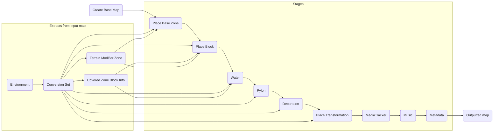

# Nations Converter 2

This is where the new TMUF is being made!

## Supported music assets

Tool adds music to non-Stadium maps by default with `IncludeMusic` setting. You can disable this option, or change the music to these links below if you want to tweak it.

ManiaCDN option will be available in the future.

### Provided by default

- Snow (Realnest Bootleg) - https://download.dashmap.live/6a43df20-cd1a-4b3b-87b9-a6835a9b416d/Snow_(RealnestBootleg).mux
- Rally (Realnest Bootleg) - https://download.dashmap.live/6a43df20-cd1a-4b3b-87b9-a6835a9b416d/Rally_(RealnestBootleg).mux
- Desert (Realnest & ThaumicTom Bootleg) - https://download.dashmap.live/6a43df20-cd1a-4b3b-87b9-a6835a9b416d/Desert_(Realnest&ThaumicTomBootleg).mux
- Island (Realnest Bootleg) - https://download.dashmap.live/6a43df20-cd1a-4b3b-87b9-a6835a9b416d/Island_(RealnestBootleg).mux
- Bay (Realnest Bootleg) - https://download.dashmap.live/6a43df20-cd1a-4b3b-87b9-a6835a9b416d/Bay_(RealnestBootleg).mux
- Coast (Realnest Bootleg) - https://download.dashmap.live/6a43df20-cd1a-4b3b-87b9-a6835a9b416d/Coast_(RealnestBootleg).mux

### Provided additionally

- Snow - https://download.dashmap.live/6a43df20-cd1a-4b3b-87b9-a6835a9b416d/Snow.mux
- Rally - https://download.dashmap.live/6a43df20-cd1a-4b3b-87b9-a6835a9b416d/Rally.mux
- Desert - https://download.dashmap.live/6a43df20-cd1a-4b3b-87b9-a6835a9b416d/Desert.mux
- Island - https://download.dashmap.live/6a43df20-cd1a-4b3b-87b9-a6835a9b416d/Island.mux
- Bay - https://download.dashmap.live/6a43df20-cd1a-4b3b-87b9-a6835a9b416d/Bay.mux
- Coast - https://download.dashmap.live/6a43df20-cd1a-4b3b-87b9-a6835a9b416d/Coast.mux

### Provided additionally soon

- Dom Lyne - Mutants
- Dom Lyne - Mutants (RealiM Bootleg) [Realnest Remaster]
- Doo - Menus
- Doo - Menus (Realnest Bootleg)
- Mick Gordon - ManiaPlanet Menu Theme (Realnest Bootleg)

## Script metadata (traits)

Every converted map includes additional metadata traits that can be used in gamemodes or map editor plugins.

| Type and Name                        | Version        | Example value                 | Description |
|--------------------------------------|----------------|-------------------------------| ----------- |
| `Boolean` `MadeWithNationsConverter` | 0.1.0+         | `True`                        | Track was made with (or with assist of) this tool. Always true.
| `Text` `NC_OriginalAuthorLogin`      | 1.0.1+         | `bigbang1112`                 | Login of the original author name. Bugged in 1.0.1, fixed since 1.0.2.
| `Text` `NC_OriginalAuthorNickname`   | 1.0.1+         | `$fff$o$n$t$iBigBang1112`     | Formatted nickname of the original author name. Empty text on maps made in TMUF and lower versions.
| `Text` `NC_OriginalMapUid`           | 1.2.0+         | `JtPkBe105hUkDkQOoieBVFZTDK9` | Map UID of the map converted before the new UID was set. Useful for original map identification.
| `Boolean` `NC2_IsConverted`          | 2.0.0-alpha.1+ | `True`                        | Track was made with (or with assist of) Nations Converter **2**.
| `Text` `NC2_ConvertedAt`             | 2.0.0-alpha.1+ | `2024-12-19T21:22:03`         | Date and time the conversion happened in ISO 8601 standard, always UTC.
| `Text` `NC2_Version`                 | 2.0.0-alpha.1+ | `2.0.0.0`                     | Version of the core NC2 library. Does not include pre-releases. Never empty.
| `Text` `NC2_CLI_Version`             | 2.0.0-alpha.1+ | `2.0.0.0`                     | Version of the CLI program that uses the NC2 library. Does not include pre-releases. Can be empty if converted in web browser.
| `Text` `NC2_Web_Version`             | 2.0.0-alpha.1+ | `2.0.0.0`                     | Version of the CLI program that uses the NC2 library. Does not include pre-releases. Can be empty if converted using CLI.
| `Text` `NC2_GBXNET_Version`          | 2.0.0-alpha.1+ | `2.1.0.0`                     | Version of the GBX.NET library that handles internal Gbx things. Does not include pre-releases. Never empty.
| `Text` `NC2_Environment`             | 2.0.0-alpha.1+ | `Desert`                      | Modern name of the converted map's environment (Alpine->Snow, Speed->Desert).
| `Text` `NC2_Phase`                   | 2.0.0-alpha.1+ | `Alpha` / `Beta` / `RC`       | Stage/phase of the version. Used to differentiate pre-releases.
| `Text` `NC2_Seed`                    | 2.0.0-alpha.1+ | `1763499756`                  | "Unique" identifier of the map, used to avoid embedding collisions and for deterministic randomization. Always numeric in 32bit range.
| `Text` `NC2_Category`                | 2.0.0-alpha.1+ | `Solid`                       |
| `Text` `NC2_SubCategory`             | 2.0.0-alpha.1+ | `Modless`                     |
| `Boolean` `NC2_IsTM2`                | 2.0.0-alpha.1+ | `False`                       | If the original map was made in TM2/TMT or TMF and older games.

Versions can be seen bugged as `1.0.0` on NC2 maps due to the projects being versioned about 1 day before the public release, and the maps being converted before that.

#### Traits that are no longer used and supported

| Type and Name               | Version           | Description |
|-----------------------------|-------------------| ----------- |
| `Boolean` `NC2_PreAlpha`    | 2.0.0 (pre-alpha) | Track was converted in pre-alpha of Nations Converter 2. In 2.0.0-alpha.1, it was removed.
| `Boolean` `NC_EarlyAccess`  | 0.1.0-1.3.5       | Conversion was made in NC1 early access. Removed because it is irrelevant.
| `Text` `NC_Assembly`        | 0.1.0-1.3.5       | User interface project version the conversion was made. Removed because format is bloaty and confusing.
| `Text` `NC_GBXNET_Assembly` | 1.0.0-1.3.5       | GBX.NET version used for the Gbx parse. Removed because format is bloaty, use `NC2_GBXNET_Version`.
| `Text` `NC_Lib_Assembly`    | 1.0.2-1.3.5       | Version of the conversion processing library. Removed because format is bloaty, use `NC2_Version`.

### Usage in ManiaScript

`declare metadata Boolean MadeWithNationsConverter for Map;`

## Technical overview

## Build

Build the solution with Visual Studio 2022 or by using `dotnet build`.

This project started using the GBX.NET nightly builds for more comfortable development.

## Convengine

This project is under very longterm plans to be rewritten into the Convengine converter engine system, which would allow cleaner structure of the converter project.
