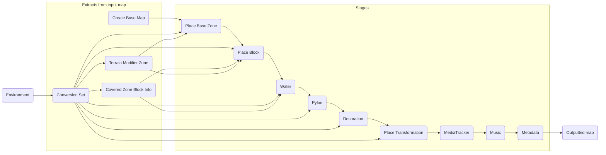

# Nations Converter 2

This is where the new TMUF is being made.

## Overview

## Build

Build the solution with Visual Studio 2022 or by using `dotnet build`.

This project started using the GBX.NET nightly builds for more comfortable development.
